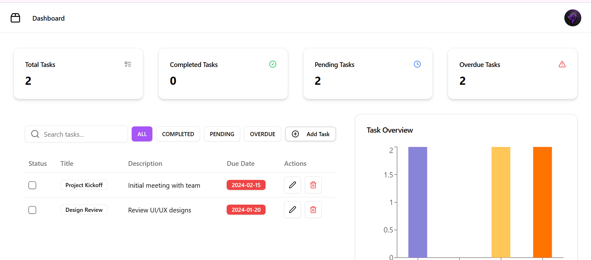

# Task Management Dashboard

## Images


## Features
- Task Overview Card
- Task Management Table
- Task Overview Graph

### Task Management
- Add new tasks with title, description, and due date
- Edit existing tasks
- Delete tasks
- Mark tasks as completed
- Search for tasks vased on title
- Filter tasks by:
  - All Tasks
  - Completed Tasks
  - Pending Tasks
  - Overdue Tasks

### Technical Highlights
- React 18
- Redux Toolkit for state management
- Shadcn/UI for modern, responsive design
- Recharts for data visualization
- Tailwind CSS for styling

## Prerequisites

Before you begin, ensure you have met the following requirements:

- Node.js (v16.0.0 or later)
- npm (v8.0.0 or later)
- Git

## Installation

1. Clone the repository
```bash
git clone https://github.com/Ompawaskar/Tasks.git
cd task-management-dashboard
```

2. Install dependencies
```bash
npm install
```

3. Install Shadcn components
```bash
npx shadcn-ui@latest init
```
- Choose React
- Choose JavaScript
- Choose Tailwind CSS
- Choose default configuration

## Available Scripts

In the project directory, you can run:

### `npm run dev`
Runs the app in development mode
Open [http://localhost:5173](http://localhost:5173) to view in browser


## State Management

The application uses Redux Toolkit for state management:
- `taskSlice.ts` handles all task-related actions
- Supports adding, editing, deleting, and toggling task completion
- Provides filtered task selectors

## Styling and Theming

- Tailwind CSS for utility-first styling
- Shadcn/UI components
- Dark/Light mode support with theme toggle

## Responsive Design

The dashboard is fully responsive:
- Mobile-first approach
- Adaptive layouts

## Contact

Your Name - ompawaskar7@gmail.com

Project Link: [https://github.com/yourusername/task-management-dashboard](https://github.com/yourusername/task-management-dashboard)